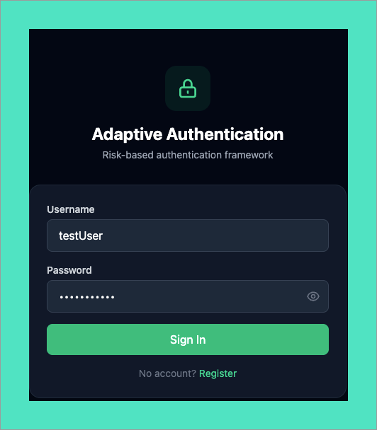
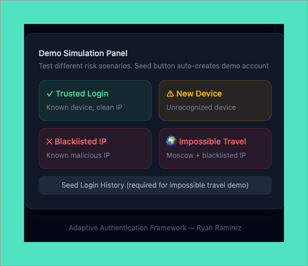
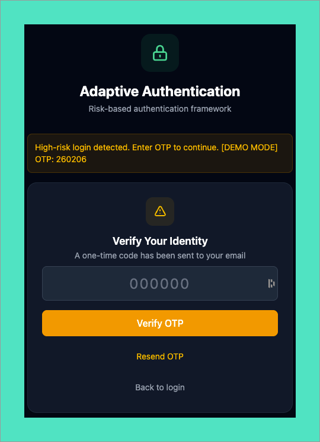

# Adaptive Authentication Framework

A full-stack risk-based authentication system that adjusts security requirements based on real-time contextual signals. Low-risk logins proceed with password-only verification, while high-risk logins are routed through conditional MFA.

**Live Demo:** [adaptive-auth-production.up.railway.app](https://adaptive-auth-production.up.railway.app)



---

## How It Works

Each login attempt is evaluated by a risk scoring engine that analyzes four signals:

| Signal | Points | What It Detects |
|---|---|---|
| **IP Reputation** | +90 | Login originating from a blacklisted IP prefix |
| **New Device** | +105 | Device fingerprint not found in the user's trusted devices |
| **Impossible Travel** | +150 | Login location requires travel speed exceeding 1,000 km/h from the last known location |
| **Atypical Time** | +30 | Login hour deviates more than 3 hours from the user's median login pattern |

Scores are additive. If the total reaches **100 or above**, the system requires OTP verification before granting access. Upon successful verification, the device is added to the user's trusted device list, allowing future logins from that device to bypass MFA. In this way, the system balances security enforcement with user experience.


---

## Demo

The live deployment includes a simulation panel with four preset scenarios. The seed button auto-creates a demo account, so no registration is required.

- **Trusted Login** : Known device, clean IP. Low risk, password only.
- **New Device** : Unrecognized device fingerprint. Triggers MFA.
- **Blacklisted IP** : Known malicious IP prefix. Triggers MFA.
- **Impossible Travel** : Moscow coordinates with blacklisted IP. All four signals fire.



When MFA is triggered, the user is presented with a one-time password challenge. In demo mode, the OTP is displayed directly in the UI banner to allow for testing the full authentication flow without requiring an email integration.



---

## Architecture

```
┌─────────────────────────────────────────────────┐
│                  React Frontend                  │
│           (Vite + Tailwind CSS)                  │
│  Login ─► OTP Challenge ─► Dashboard             │
│  Registration    Simulation Panel                │
└──────────────────────┬──────────────────────────┘
                       │ HTTP (Axios)
┌──────────────────────▼──────────────────────────┐
│                 FastAPI Backend                   │
│                                                  │
│  /auth/register     POST  Create user account    │
│  /auth/login        POST  Authenticate + assess  │
│  /auth/verify-otp   POST  Verify OTP + trust dev │
│  /demo/simulate     POST  Simulate risk scenario │
│  /demo/seed         POST  Populate test data     │
│  /docs              GET   Swagger UI (auto-gen)  │
│                                                  │
│  ┌────────────────────────────────────┐          │
│  │        Risk Engine                 │          │
│  │  IP check ─► Device check         │          │
│  │  Travel check ─► Time check       │          │
│  │  ─► Cumulative score ─► Route     │          │
│  └────────────────────────────────────┘          │
└──────────────────────┬──────────────────────────┘
                       │ SQLAlchemy ORM
┌──────────────────────▼──────────────────────────┐
│              SQLite Database                      │
│                                                  │
│  users ─── login_attempts ─── trusted_devices    │
│                pending_auth                       │
└─────────────────────────────────────────────────┘
```

## Tech Stack

- **Backend:** Python, FastAPI, SQLAlchemy, bcrypt, python-jose
- **Frontend:** React, Vite, Tailwind CSS, Axios
- **Database:** SQLite for development, swappable to PostgreSQL via a single configuration change
- **Deployment:** Railway (Nixpacks builder)

## Project Structure

```
adaptive-auth/
├── app/
│   ├── auth.py           # Register, login, OTP verification endpoints
│   ├── config.py         # Environment variables (SECRET_KEY, DATABASE_URL)
│   ├── database.py       # SQLAlchemy engine and session setup
│   ├── demo.py           # Simulation and seed endpoints for live demos
│   ├── main.py           # FastAPI app, serves compiled React frontend
│   ├── models.py         # User, LoginAttempt, TrustedDevice, PendingAuth
│   ├── risk_engine.py    # Risk scoring logic (4 signals, threshold routing)
│   └── schemas.py        # Pydantic request/response models
├── frontend/
│   ├── src/App.jsx       # Main React component (all views)
│   └── dist/             # Compiled frontend (served by FastAPI)
├── Procfile              # Railway start command
├── railway.toml          # Deployment config
├── requirements.txt      # Python dependencies
└── .gitignore
```

## Risk Engine Detail

The engine in `risk_engine.py` evaluates each signal independently and produces a cumulative score:

**IP Reputation** checks the source IP against a configurable blacklist of known malicious prefixes. In a production environment, this would be replaced with a call to an external API such as AbuseIPDB.

**New Device** queries the `trusted_devices` table for the user's device fingerprint. If the fingerprint has not been previously verified through MFA, it is flagged. Device trust is only granted after a successful OTP verification, not assumed from prior sessions.

**Impossible Travel** applies the haversine formula to calculate the great-circle distance between the current login coordinates and the most recent login with location data. The distance is divided by elapsed time to determine the required travel speed. Any speed exceeding 1,000 km/h, which is faster than commercial aviation, triggers the flag.

**Atypical Time** calculates the median login hour from the user's last 30 days of successful logins. If the current login hour deviates by more than 3 hours, accounting for midnight wraparound, it is flagged. A minimum of 5 prior logins is required to establish a baseline pattern.

## Running Locally

```bash
# Clone
git clone https://github.com/ryan-t-ramirez/Adaptive-Auth.git
cd Adaptive-Auth/adaptive-auth

# Backend
python3 -m venv venv
source venv/bin/activate
pip install -r requirements.txt

# Frontend (optional, dist/ is already committed)
cd frontend
npm install
npm run build
cd ..

# Run
uvicorn app.main:app --reload
# Open http://127.0.0.1:8000
```

## Design Decisions

- **FastAPI over Flask**: Provides auto-generated OpenAPI documentation, Pydantic type validation, and async support without additional configuration
- **Single-service deployment**: FastAPI serves the compiled React build from `dist/`, removing the need for separate frontend hosting or CORS configuration
- **SQLite for dev, PostgreSQL for prod**: SQLAlchemy abstracts the database layer, making the switch a single-line configuration change
- **OTP hashed before storage**: SHA-256 hashed prior to storage, following the same security principle as password handling. 6-digit code, 5-minute expiry, 3 attempt maximum
- **Device trust is earned**: Trust is only granted after successful MFA verification, not assumed from a cookie or prior session
- **Risk threshold at 100**: Any new device alone (+105) exceeds the threshold and requires MFA, while trusted devices proceed with password-only authentication

## Author

**Ryan Ramirez** | IAM Engineer | [GitHub](https://github.com/ryan-t-ramirez)
